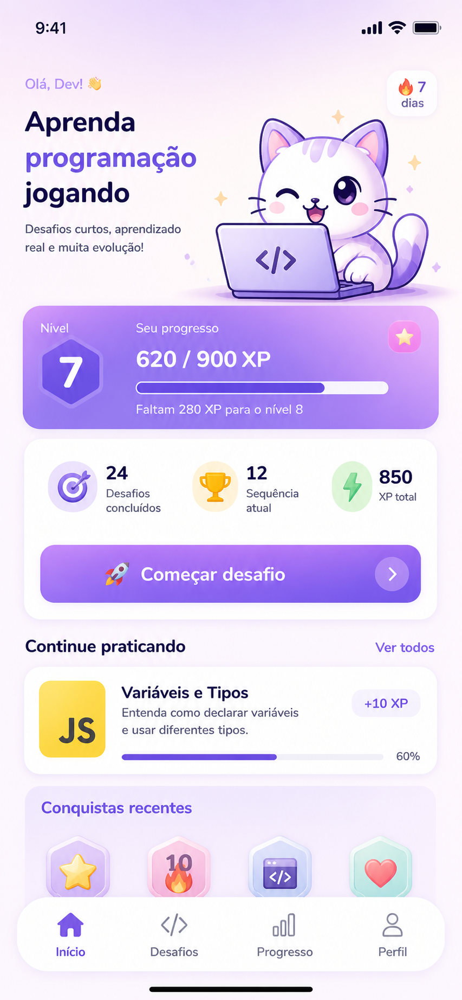

# coda-aí

App PWA/mobile-first para ensinar programação de forma gamificada, inspirado em experiências como Duolingo e Mimo.



## Funcionalidades

- Home com saudação, mascote, nível, XP, sequência e novidades do mês.
- Navegação inferior com Início, Desafios, Progresso e Perfil.
- Trilhas de aprendizado para Lógica de programação, JavaScript, Python, SQL, Git/GitHub, APIs e AWS Básico.
- Tela de desafios por trilha, com progresso e seleção de lições.
- Tela de desafio com pergunta, exemplos, editor simples, dica, limpeza de código e validação inicial.
- XP concedido apenas uma vez por desafio concluído.
- Progresso salvo em `localStorage`, com migração simples para dados antigos.
- Perfil com avatar/mascote, nome editável, nível, XP, sequência, trilha atual, conquistas e reset com confirmação.
- Base para atualizações mensais de conteúdo.
- PWA instalável com manifest, ícone, tema mobile, splash e service worker básico.

## Tecnologias

- React
- Vite
- TailwindCSS
- Zustand
- LocalStorage
- Framer Motion
- Lucide React

## Instalação

```bash
npm install
npm run dev
```

Depois, abra a URL exibida pelo Vite no navegador.

## Como instalar como PWA

O coda-aí pode ser instalado no celular pela opção "Adicionar à tela inicial".

Android/Chrome:

1. Abra o coda-aí no Chrome.
2. Toque nos três pontos.
3. Toque em “Adicionar à tela inicial”.
4. Confirme.

iPhone/Safari:

1. Abra o coda-aí no Safari.
2. Toque no botão de compartilhar.
3. Toque em “Adicionar à Tela de Início”.
4. Confirme.

## Scripts

```bash
npm run dev
npm run build
npm run preview
npm run deploy
```

## Publicar no GitHub Pages

O projeto está preparado para GitHub Pages usando Vite com `base: '/coda-ai/'` em `vite.config.js` e deploy da pasta `dist` com `gh-pages`.

Passo a passo:

1. Crie um repositório no GitHub chamado `coda-ai`.
2. Configure o remoto local:

```bash
git remote add origin https://github.com/SEU_USUARIO/coda-ai.git
```

3. Envie o código para a branch principal:

```bash
git add .
git commit -m "prepare coda-aí for github pages"
git branch -M main
git push -u origin main
```

4. Publique o app no GitHub Pages:

```bash
npm run deploy
```

5. No GitHub, abra `Settings > Pages` e selecione a branch `gh-pages` como origem do Pages.

URL publicada atualmente:

```text
http://orsini-systems.me/coda-ai/
```

URL padrão alternativa do GitHub Pages:

```text
https://SEU_USUARIO.github.io/coda-ai/
```

Neste repositório:

```text
https://Aarleyzin.github.io/coda-ai/
```

O domínio `orsini-systems.me` vem da configuração de domínio personalizado do GitHub Pages da conta/usuário. O projeto não precisa de um arquivo `CNAME` próprio para continuar funcionando nele.

Se o repositório tiver outro nome, ajuste o `base` em `vite.config.js` para `'/nome-do-repositorio/'` antes de rodar `npm run build` ou `npm run deploy`.

## Estrutura de pastas

```text
public/
  assets/
    icon/
    mascot/
    screens/
    splash/
src/
  components/
  data/
    challenges.js
    monthlyContent.js
  pages/
    Home.jsx
    Challenges.jsx
    Challenge.jsx
    Progress.jsx
    Profile.jsx
  store/
    useGameStore.js
  utils/
    validation.js
```

## Como adicionar nova trilha

Edite `src/data/challenges.js` e adicione um novo objeto em `learningTracks`:

```js
{
  id: 'nova-trilha',
  title: 'Nova Trilha',
  description: 'Descricao curta da trilha.',
  difficulty: 'Iniciante',
  icon: 'NT',
  color: 'from-sky-200 to-cyan-200',
  lessons: []
}
```

## Como adicionar novos desafios

Dentro da trilha desejada, adicione um item em `lessons`:

```js
{
  id: 'js-004',
  title: 'Arrays',
  reward: 10,
  question: 'Crie um array chamado numeros com 1, 2 e 3.',
  examples: ['const frutas = ["maca", "banana"]'],
  starterCode: '// escreva sua resposta aqui',
  answer: 'const numeros = [1, 2, 3]',
  hint: 'Use colchetes para criar arrays.',
  explanation: 'Arrays guardam listas de valores.'
}
```

Use ids únicos para não conflitar com o progresso salvo no navegador.

## Plano de atualizações mensais

As novidades ficam em `src/data/monthlyContent.js`. Cada atualização deve ter:

- `month`
- `year`
- `title`
- `description`
- `newLessons`
- `newTracksOrChallenges`
- `status`

## Persistência

O estado do usuário é salvo com Zustand em `localStorage`, usando a chave legada `codaai-progress-v2` para preservar progresso de versões anteriores. O app preserva nome, XP, nível, sequência, desafios concluídos, progresso por trilha, conquistas, tentativas e data do último acesso.

O reset de progresso só acontece por ação explícita do usuário e exige confirmação.

## Roadmap

- IA explicando erros.
- Editor estilo VS Code.
- Ranking.
- Login.
- Backend.
- App mobile nativo.
- Assinatura premium.

## Contribuição

Contribuições são bem-vindas. Para colaborar, crie uma branch, mantenha o app mobile-first, não remova funcionalidades existentes, preserve o `localStorage` e rode `npm run build` antes de abrir um pull request.

## Licença

MIT
